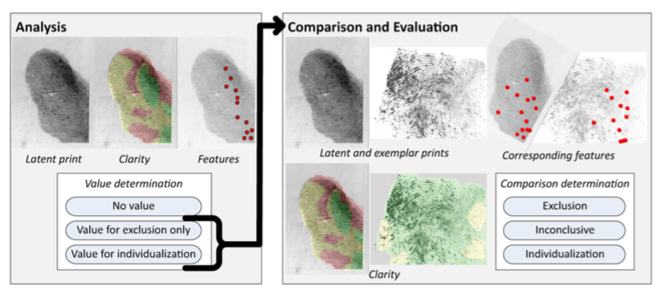

## Examination Process

Latent print examiners compare latents which are impressions from the fingers of an unknown person to exemplars which are prints collect from known subjects. They do this in order to determine whether the two prints came from the same source. Their determinations are critical as testimony on fingerprint evidence presented in court is based on it. There are three possible determinations:

* Individualization

* Inconclusive

* Exclusion

Procedures for examination vary among agencies. In general though, there are two components of the sufficiency criteria: the examiner's evaluation of the print's content and how much agreement is adequate. However, none of these components are standardized. An individualization determination by an examiner is dependent on their evaluation of the quantity and corresponding features, relationships and specificity.

The examination process is described by the acronym ACE. It stands for analysis, comparison, and evaluation. The analysis phase is an interpretation of how the latent print was deposited and developed. The comparison phase is the comparison of the latent print to the exemplar. Finally, the evaluation phase is an evaluation of whether corresponding features are adequate enough to support a determination. Since the process is dependent on the examiner's proficiency and not formal criteria, it is of interest to understand how much information is sufficient for an examiner to make a conclusion.

The purpose of the White Box study is to determine "what information must be accounted for when describing the decision threshold, how the reproducibility of individualizations is associated with annotations, and to what extent disagreements among examiners arise from differing criteria as to what constitutes sufficiency vs. differing interpretations of the prints." In this study, latent print examiners annotated certain features and correspondences in latents and exemplars while performing examinations.

Each examiner was given a sequence of latent-exemplar pairs. "Mated" pairs were from the same source while "non-mated" pairs originated from different sources. The process for each pair is shown below.

```{r, echo=FALSE, fig.cap="Test workflow"}
library(graphics)
library(bookdown)
library(knitr)


```

During the analysis phase, the examiner annotated clarity and features. Afterwards, they recorded a value determination: value for individualization (VID), value for exclusion only (VEO), or no value (NV). During the comparison phase, the examiner recorded a comparison determination: individualization, exclusion, or inconclusive.

## Data

There were eight public data tables provided from the White Box study. The following table contains the value and comparison determinations for each trial. In addition, it contains information on the number of features marked and corresponding features between latents and exemplars. Each row corresponds to a presentation of an image pair to an examiner. In this dataset, 170 examiners responded to approximately 22 presentation of image pairs.


## Conclusions

This study found that there were significant differences among examiners' annotations. However, the study could not distinguish whether this was due to how the examiners interpreted the data or how they document them. In addition, the lack of a standard for marking features possibly contributed to the observed variability in annotations. Examiners' individualization determinations were found to be related to the number of corresponding minutiae marked while clarity was not as strongly associated. While ACE is designed such that determinations are based on the evaluation of features, the study suggests that examiners may reach preliminary determinations prior to the comparison phase.These findings suggests that a standardized procedure could lead to more consistency in annotations and better transparency in casework.
